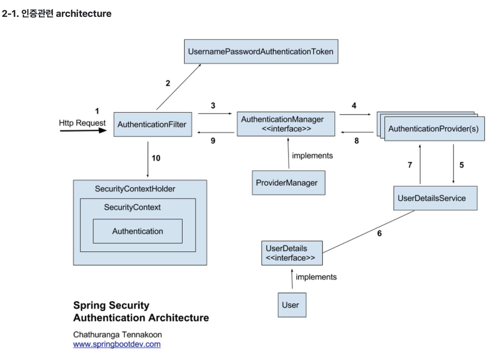

# Spring Security

## 처리과정

> 1. Http Request로 로그인 인증을 받는다.
> 2. AuthemticationFilter에서 토큰(UsernamePasswordAuthenticationToken) 발급
> 3. AuthenticationManager에서 토큰을 ProviderManager 객체에 저장한다.
> 4. 실제 인증할 AuthenticationProvider에 위에서 받은 토큰을 다시 전달한다.
> 5. DB에서 가져올 user 정보를 UserDetailsService에 전달한다.
> 6. 실제 정보를 UserDetails에 저장 후 UserDetailsService에 전달한다.
> 7. AuthenticationProvider에서 전달받은 UserDetails와 Request로 받은 정보 비교한다.
> 8. 인증 완료 시 유저 정보를 사용자 정보를 담은 Authentication 객체를 반환한다.
> 9. Authentication 객체를 AuthemticationFilter에 전달한다.
> 10. Authenticaton 객체를 SecurityContext에 저장한다.

## 구조

### AuthenticationFilter
(Spring Filter 와 유사한 역할) 인증 및 권한 부여 과정을 선제적으로 거친 후 요청을 넘기는 역할

### UsernamePasswordAuthenticationToken
Token 중에서 Principal-Credential 패턴을 반영한 객체이며 가장 기본적인 Authentication 구현체

### AuthenticationManager
유저의 요청을 AuthenticationFilter에서 Authentication 객체로 변환한 후 전달하고 AuthenticationProvider가 실제 인증을 한 이후에 인증이 완료되면 Authentication객체를 반환해 주는 다리 역할

### AuthenticationProvider
실제로 인증 검증을 하는 역할, 인증 전의 Authentication객체를 받아서 인증이 완료된 객체를 반환하는 역할

### UserdetailsService / UserDetails
데이터베이스에서 유저 정보를 불러와서 UserDetails 객체를 만들어 돌려주는 역할

### SecurityContext
SecurityContext 에 Authentication 객체를 저장
 
인증이 필요한 순간에 꺼내서 권한을 확인하고 인가를 할지 말지를 결정

## Reference
- [Spring Security의 구조(Architecture) 및 처리 과정 알아보기](https://dev-coco.tistory.com/174)
- [스프링 부트 Spring Security를 활용한 인증 및 권한부여](https://www.bottlehs.com/springboot/%EC%8A%A4%ED%94%84%EB%A7%81-%EB%B6%80%ED%8A%B8-spring-security%EB%A5%BC-%ED%99%9C%EC%9A%A9%ED%95%9C-%EC%9D%B8%EC%A6%9D-%EB%B0%8F-%EA%B6%8C%ED%95%9C%EB%B6%80%EC%97%AC/)
- [[JAVA/SPRING] Spring Security 구조 및 역할](https://velog.io/@park9910/Spring-Security-%EA%B5%AC%EC%A1%B0-%EB%B0%8F-%EC%97%AD%ED%95%A0)
- [[SpringBoot] Spring Security란?](https://mangkyu.tistory.com/76)